# EQ-PMS (Equipment Project Management System)

장비 프로젝트 셋업 관리 시스템  
반도체 / 디스플레이 / 2차전지 장비의 현장 셋업 프로젝트를 통합 관리하는 웹 애플리케이션

---

## 1. 기술 스택

| 구분 | 기술 |
|------|------|
| Framework | React 19 (Create React App) |
| UI/스타일링 | Tailwind CSS 3 (빌드 타임), Lucide React Icons |
| 백엔드/DB | Google Apps Script (GAS) Web App → Google Sheets |
| 알림 | Google Apps Script Webhook |
| 성능 최적화 | React.memo, React.lazy, Suspense, useCallback |
| 배포 | 정적 빌드 (SPA) - 내부망/외부 서버 모두 가능 |
| 언어 지원 | 한국어 / English 실시간 전환 |

---

## 2. 프로젝트 구조

```
eq-pms-app/
├── build/                         # 프로덕션 빌드 결과물 (배포 대상)
├── src/
│   ├── constants/
│   │   └── index.js               # 전역 상수, 초기 데이터, 도메인별 태스크/체크리스트
│   ├── utils/
│   │   ├── api.js                 # saveToGoogleDB, notifyWebhook
│   │   ├── calc.js                # calcExp(기대진행률), calcAct(실제진행률)
│   │   ├── calendar.js            # downloadICS, openGoogleCalendar
│   │   ├── export.js              # generatePDF, exportToCSV
│   │   └── status.js              # getStatusColor (상태별 색상)
│   ├── components/
│   │   ├── common/                # 공통 재사용 UI (8개)
│   │   │   ├── NavItem.js         # 사이드바 네비게이션 버튼
│   │   │   ├── StatCard.js        # 대시보드 통계 카드
│   │   │   ├── SimpleDonutChart.js
│   │   │   ├── SimpleBarChart.js
│   │   │   ├── ProjectPipelineStepper.js  # 7단계 파이프라인
│   │   │   ├── ProjectIssueBadge.js       # 이슈 뱃지 + 드롭다운
│   │   │   ├── SignaturePad.js            # 고객 전자서명
│   │   │   └── ModalWrapper.js            # 공통 모달 프레임
│   │   ├── modals/                # 모달 컴포넌트 (13개)
│   │   │   ├── ProjectModal.js
│   │   │   ├── IssueModal.js / MobileIssueModal.js
│   │   │   ├── PartModal.js / MobilePartModal.js
│   │   │   ├── SiteModal.js
│   │   │   ├── TaskModal.js       # 셋업 태스크 + 체크리스트 + 서명
│   │   │   ├── IssueDetailModal.js
│   │   │   ├── VersionModal.js / ReleaseModal.js
│   │   │   ├── EngineerModal.js / DailyReportModal.js
│   │   │   └── DeleteConfirmModal.js
│   │   └── views/                 # 페이지 뷰 컴포넌트 (8개)
│   │       ├── DashboardView.js
│   │       ├── ProjectListView.js # 리스트 + 간트 차트
│   │       ├── IssueListView.js
│   │       ├── PartsListView.js
│   │       ├── SiteListView.js
│   │       ├── ResourceListView.js
│   │       ├── VersionHistoryView.js
│   │       └── LoginScreen.js
│   ├── App.js                     # 메인 앱 (~300줄, 상태관리 + 라우팅)
│   ├── App.css
│   ├── index.js                   # React 엔트리포인트
│   └── index.css                  # Tailwind 지시문 + 글로벌 스타일
├── tailwind.config.js
├── package.json
└── README.md
```

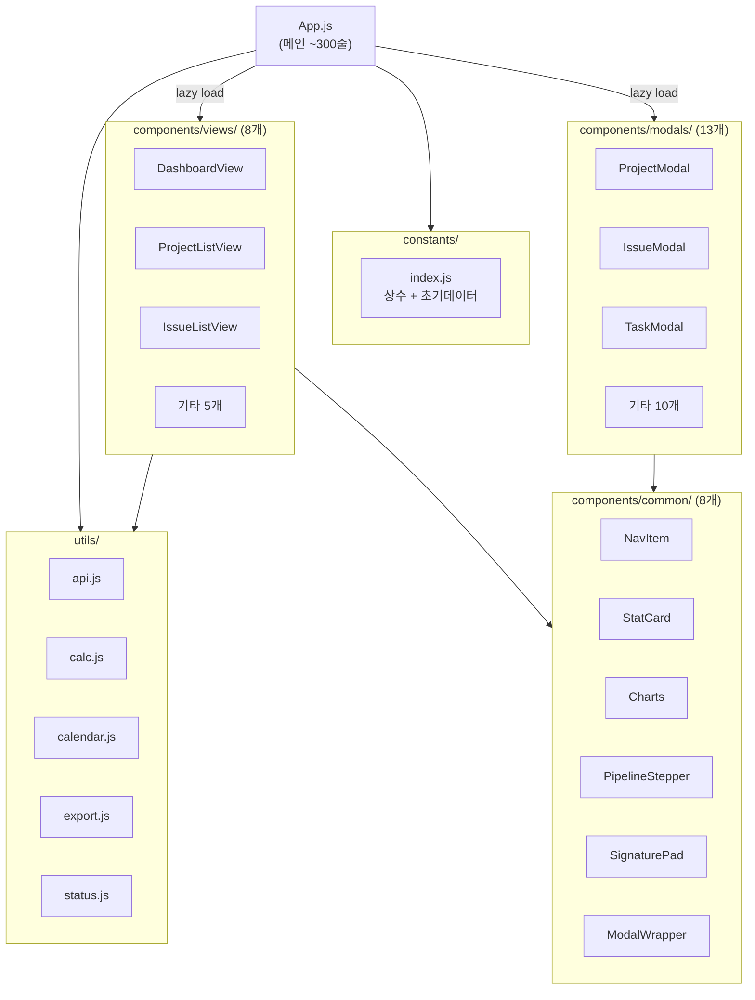

---

## 3. 전체 시스템 아키텍처

```
[사용자 브라우저]
    │
    ├── PC 데스크톱 모드 (사이드바 + 7개 메뉴)
    │
    └── 모바일 현장 모드 (하단탭 + 카메라/갤러리 직접 연동)
         │
         ▼
[React SPA - build/ 폴더 배포]
    │
    ├── useState로 로컬 상태 관리 (프로젝트/이슈/자재/인력 등)
    │
    ├── saveToGoogleDB() ──→ [Google Apps Script Web App] ──→ [Google Sheets DB]
    │
    └── notifyWebhook()  ──→ [GAS Webhook] ──→ 이메일/알림 발송
```

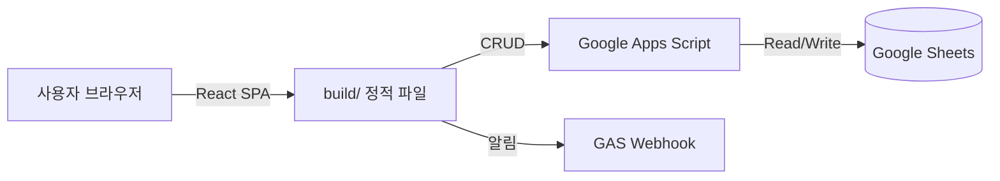

---

## 4. 사용자 역할 및 로그인 시스템

### 4-1. 로그인 모드 (TEST vs 운영)

빌드 타임 환경변수 `REACT_APP_TEST_MODE` 한 줄로 두 가지 모드가 분기됨. 인증 로직 자체는 동일하며 **시드 계정**과 **첫 로그인 UX**만 달라짐.

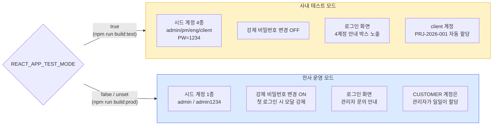

| 항목 | 사내 테스트 (TEST) | 전사 운영 (PROD) |
|---|---|---|
| 시드 계정 | `admin/pm/eng/client` (PW `1234`) | `admin` (PW `admin1234`) |
| 강제 비밀번호 변경 | OFF | ON |
| 로그인 안내 박스 | 4계정 표시 | 비표시 |
| 빌드 명령 | `npm run build:test` | `npm run build:prod` |
| 환경 파일 | `.env.development` | `.env.production` |

### 4-2. 로그인 플로우

```mermaid
flowchart TD
    A[앱 시작] --> B{GAS users 시트<br/>로드}
    B -- "데이터 있음" --> C[기존 사용자 목록 사용]
    B -- "비어있음" --> D{TEST_MODE?}
    D -- "true" --> E[4계정 자동 시드<br/>+ 시트 저장]
    D -- "false" --> F[admin 1계정 시드<br/>+ 시트 저장]
    C --> G[로그인 화면]
    E --> G
    F --> G

    G --> H[ID/PW 입력]
    H --> I{ID 존재?}
    I -- "no" --> ERR1[아이디/비밀번호<br/>오류 메시지]
    I -- "yes" --> J{active === false?}
    J -- "yes" --> ERR2[비활성화된 계정]
    J -- "no" --> K[입력 PW를 SHA-256 해시화]
    K --> L{저장 해시와<br/>일치?}
    L -- "no" --> M{시드 평문과<br/>일치?<br/>(호환 비교)}
    M -- "no" --> ERR1
    L -- "yes" --> N[로그인 성공]
    M -- "yes" --> N

    N --> O[lastLoginAt 갱신<br/>+ 시트 동기화]
    O --> P{mustChangePassword<br/>=== true?}
    P -- "yes" --> Q[비밀번호 변경 모달<br/>강제 표시 - 닫기 불가]
    P -- "no" --> R[대시보드 진입]
    Q --> S[새 PW 입력 → 해시 → 저장] --> R

    ERR1 --> G
    ERR2 --> G

    style ERR1 fill:#fee2e2,stroke:#dc2626
    style ERR2 fill:#fee2e2,stroke:#dc2626
    style N fill:#d1fae5,stroke:#059669
    style R fill:#d1fae5,stroke:#059669
    style Q fill:#fef3c7,stroke:#d97706
```

### 4-3. 역할 (Role) 및 권한 매트릭스

4개 역할 기반 접근 제어 (RBAC). 로그인 후 역할에 따라 메뉴/버튼/데이터가 자동으로 제한됨.

| 역할 | 설명 | 메뉴 접근 | 데이터 범위 |
|------|------|----------|-----------|
| **ADMIN** | 본사 관리자 | 전체 + 사용자 관리 | 전체 |
| **PM** | 프로젝트 매니저 | 전체 (사용자 관리 제외) | 전체 |
| **ENGINEER** | 셋업 엔지니어 | 전체 (사용자 관리 제외) | 전체 |
| **CUSTOMER** | 고객사 담당자 | 대시보드/프로젝트/이슈 + Buy-off 서명 | **`assignedProjectIds`에 명시된 프로젝트만** |

| 메뉴 / 동작 | ADMIN | PM | ENGINEER | CUSTOMER |
|---|:-:|:-:|:-:|:-:|
| 대시보드 | ● | ● | ● | ● (할당분만) |
| 프로젝트 관리 | ● | ● | ● | ● (할당분만, 읽기 전용) |
| 이슈 관리 | ● | ● | ● | ● (할당분만) |
| 자재/사이트/리소스 | ● | ● | ● | - |
| 버전 릴리즈 | ● | ● | ● | - |
| **사용자 관리** | ● | - | - | - |
| 비밀번호 변경(자기) | ● | ● | ● | ● |
| 고객 요청 등록 | ● | ● | ● | ● |
| 고객 요청 상태 변경(처리 결과 기록) | ● | ● | ● | - |

### 4-4. CUSTOMER 데이터 필터링

CUSTOMER 계정은 `assignedProjectIds` 배열에 명시된 프로젝트만 보임. 사용자 관리에서 admin이 체크박스로 할당.

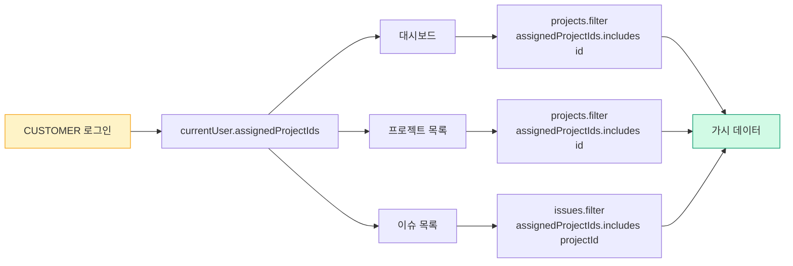

### 4-5. 사내 테스트 → 전사 배포 전환 체크리스트

1. Google Sheets `users` 시트의 시드 4계정(`admin/pm/eng/client`) 삭제
2. `npm run build:prod` 로 운영 빌드
3. 시드 admin 계정의 비밀번호를 즉시 변경 (강제 모달)
4. ADMIN 로그인 → **사용자 관리** 메뉴에서 실 사용자 등록
5. CUSTOMER 계정마다 **접근 가능 프로젝트** 체크박스로 할당 부여

> 자세한 적용 가이드는 [`docs/AUTH_README.md`](docs/AUTH_README.md) 참조

---

## 5. 주요 기능 (7개 메뉴)

### 5-1. 대시보드 (Dashboard)
- 프로젝트 현황 통계 카드: 총 프로젝트 수, 진행중, 미해결 이슈, 완료
- 상태별 분포 도넛 차트
- 도메인별 프로젝트 수 바 차트
- 엔지니어 파견 현황 요약

### 5-2. 프로젝트 관리 (Projects)
- 프로젝트 생성/조회/삭제 (CRUD)
- **7단계 파이프라인 스테퍼**: 영업/수주 → 설계 → 구매/자재 → 제조/조립 → 출하 → 현장 셋업 → 완료
- 도메인 선택 시 해당 도메인의 기본 셋업 태스크 & 체크리스트 자동 로드
- **기대 진행률 vs 실제 진행률** 비교 (일정 기반 vs 태스크 완료 기반)
- 리스트 뷰 / 간트 차트 뷰 전환
- HW / SW / FW 버전 관리
- ICS 캘린더 파일 다운로드 / 구글 캘린더 일정 추가
- Notion 링크 연동
- 프로젝트별 미해결 이슈 뱃지 표시 → 클릭하면 이슈 목록 드롭다운

### 5-3. 이슈/펀치 관리 (Issues)
- 이슈 등록 (심각도: High / Medium / Low)
- **3단계 이슈 추적**: 이슈 확인 → 조치 진행 중 → 조치 완료
- 코멘트 스레드 (담당자 간 소통)
- 현장 사진 첨부 (카메라 촬영 / 갤러리 선택)
- 이슈 등록 시 알림 이메일 지정 → Webhook으로 알림 발송

### 5-4. 자재/스페어파트 (Parts)
- 자재 청구 등록: 부품명, 파트넘버, 수량, 긴급도, 사진 첨부
- **4단계 자재 추적**: 청구 → 발주 → 입고 → 교체완료
- 긴급도별 필터링 (High / Medium / Low)

### 5-5. 사이트/유틸 마스터 (Sites)
- 고객사 Fab 인프라 정보 등록/수정/삭제
- 관리 항목: 전력(Power), 냉각수(PCW), 가스(Gas), 반입 중량 제한, 특이사항
- 현장 엔지니어가 셋업 전 인프라 제약 조건을 사전 확인하는 용도

### 5-6. 인력/리소스 관리 (Resources)
- 엔지니어 정보 등록/수정/삭제: 이름, 소속, 역할, 현재 파견지
- 상태 관리: 현장 파견 / 본사 복귀
- **출입 권한 만료일** 추적 (만료 임박 시 경고)
- 배정 프로젝트 연결

### 5-7. 버전 릴리즈 관리 (Releases)
- HW / SW / FW 릴리즈 이력 등록/삭제
- 버전별 변경 사항(Description) 기록
- 작성자 및 일자 관리

---

## 6. 장비 셋업 프로세스 (도메인별)

프로젝트 생성 시 **4개 도메인** 중 선택하면, 해당 도메인에 맞는 셋업 태스크와 Buy-off 체크리스트가 자동으로 세팅됨.

### 반도체 (7단계)
1. 장비 반입, 도킹 및 Leveling
2. 유틸리티 (PCW, Power, Gas, Vacuum) 훅업
3. 전원 인가 및 I/O, Interlock 체크
4. 소프트웨어 셋업 및 SECS/GEM 통신 연동
5. 웨이퍼 로봇 티칭 및 이송 테스트
6. 공정(Process) 테스트 및 수율 확보
7. **최종 검수 (Buy-off) 및 인수인계**

> 체크리스트: Leveling 확인, PCW/Vacuum 압력, SECS/GEM Online, 웨이퍼 Scratch, EMO/파티클

### 디스플레이 (6단계)
1. 챔버/모듈 반입 및 프레임 조립
2. 유틸리티 (Power, PCW, CDA) 훅업
3. 전원 인가 및 System Alarm Clear
4. 글라스 이송 로봇 및 스테이지 얼라인먼트
5. 진공/플라즈마 테스트 및 Tact Time 최적화
6. **최종 양산 평가 (Buy-off) 및 인수인계**

> 체크리스트: 도킹 단차/Leveling, CDA/PCW/Power, Glass Alignment, 진공/플라즈마, 안전펜스/EMO

### 2차전지 사이클러 (7단계)
1. 랙(Rack) 및 채널 유닛 반입/조립
2. 대전류 케이블 및 통신 케이블 포설
3. 전원 인가 및 BMS 네트워크 훅업
4. 채널별 전압/전류(V/I) 캘리브레이션
5. 충방전 프로파일 구동 및 발열 테스트
6. 화재/온도 보호 인터락 동작 테스트
7. **최종 검수 (Buy-off) 및 고객 인수인계**

> 체크리스트: 절연/접지 저항, 체결 토크, BMS 통신, V/I 편차, 과전압/화재 알람

### 2차전지 EOL (6단계)
1. 라인 반입 및 컨베이어/스토퍼 도킹
2. 전원, 공압 훅업 및 I/O 테스트
3. 계측기 (IR/OCV, 헬륨 리크 디텍터) 셋업
4. 바코드/비전 스캐너 연동 및 상위 MES 통신
5. 마스터 샘플 검증 (Gauge R&R, Cpk 확보)
6. **최종 검수 (Buy-off) 및 양산 이관**

> 체크리스트: 컨베이어/롤러, I/O/공압, IR/OCV 영점, 바코드/MES 매핑, Area Sensor/EMO

---

## 7. 프로젝트 라이프사이클 (전체 흐름)

```
[프로젝트 생성]
    │  도메인 선택 (반도체/디스플레이/2차전지 사이클러/2차전지 EOL)
    │  기본 정보 입력 (고객사, 사이트, 일정, 담당 PM)
    ▼
[파이프라인 관리]
    │  영업/수주 → 설계 → 구매/자재 → 제조/조립 → 출하 → 현장 셋업 → 완료
    │  각 단계 클릭으로 진행 상태 변경
    ▼
[현장 셋업 단계]
    │  도메인별 셋업 태스크 체크 (완료 토글)
    │  지연 발생 시 사유 입력
    │  이슈 발생 시 이슈 등록 + 사진 첨부 + 알림
    │  필요 자재 청구 (청구→발주→입고→교체완료)
    ▼
[Buy-off 검수]
    │  도메인별 체크리스트 항목 OK/NG/N-A 판정
    │  모든 항목 확인 후 고객 서명 (SignaturePad)
    ▼
[완료]
    │  Buy-off Report PDF 자동 생성 및 인쇄
    │  프로젝트 상태 "완료"로 전환
    └  CSV 데이터 내보내기 가능
```

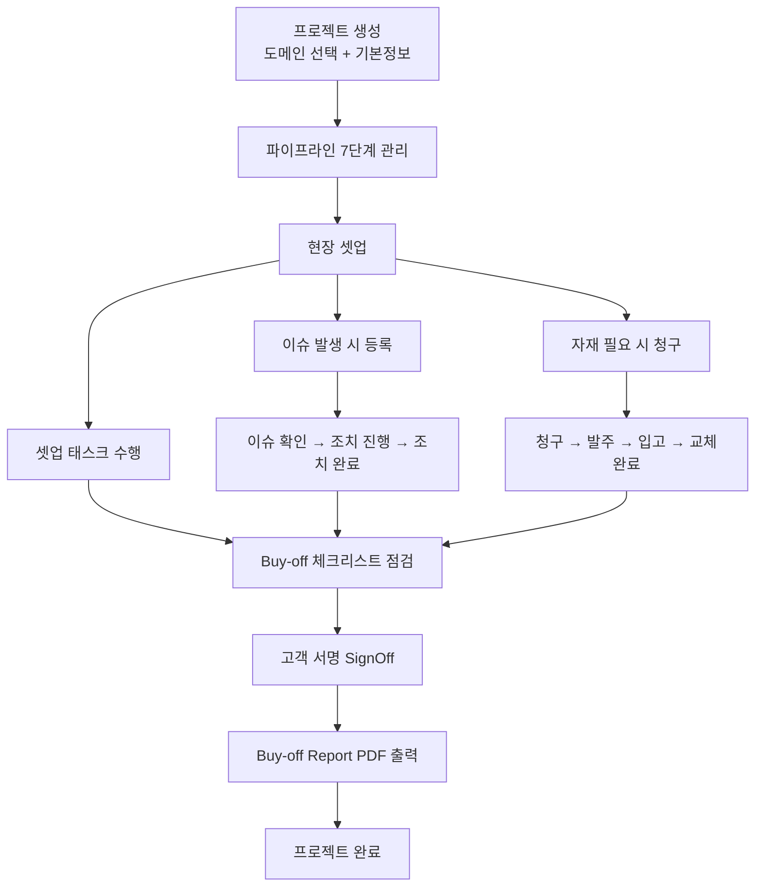

---

## 8. PC 모드 vs 모바일 현장 모드

하나의 앱에서 버튼 하나로 PC/모바일 모드를 전환 가능.

| 구분 | PC 데스크톱 모드 | 모바일 현장 모드 |
|------|-----------------|-----------------|
| **레이아웃** | 좌측 사이드바 + 상단 헤더 + 메인 콘텐츠 | 상단 헤더 + 하단 탭바 (고정) |
| **메뉴 수** | 7개 전체 | 4개 (홈/프로젝트/이슈/인프라) |
| **이슈 등록** | 일반 폼 모달 | 전체 화면 모달 + 카메라/갤러리 직접 연동 |
| **자재 청구** | 일반 폼 모달 | 전체 화면 모달 (현장 최적화 UI) |
| **대시보드** | 통계 차트 + 상세 테이블 | 빠른 액션 버튼 4개 + 배정 현장 요약 카드 |
| **전환 방법** | 헤더의 "모바일 현장 모드" 버튼 | 헤더의 "PC화면" 버튼 |

---

## 9. 리팩토링 상세 (v2.0)

### Before → After

| 항목 | Before (v1) | After (v2) |
|------|-------------|------------|
| **App.js** | 2,300줄 싱글 파일 | ~300줄 (상태관리 + 라우팅만) |
| **파일 수** | 1개 (App.js) | **30개+** (역할별 분리) |
| **Tailwind** | CDN 런타임 로드 + tailwindReady 체크 | 빌드 타임 (tree-shaking 적용) |
| **컴포넌트 렌더링** | 매번 전체 리렌더링 | React.memo로 불필요한 렌더링 차단 |
| **코드 로딩** | 한 번에 전체 로드 | React.lazy + Suspense (지연 로딩) |
| **State 업데이트** | 직접 참조 `setX(data)` | 함수형 `setX(prev => ...)` |

### 최적화 기법 요약

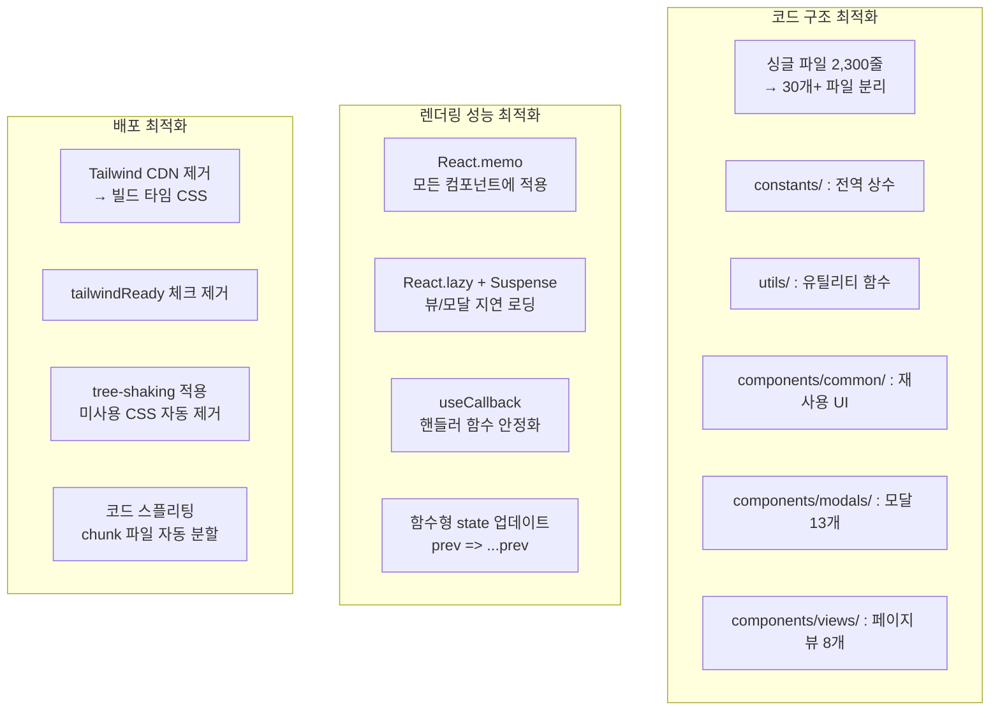

---

## 10. 내부망 배포 가이드

이 앱은 **정적 SPA(Single Page Application)**이므로, 빌드 결과물(`build/` 폴더)을 웹서버에 올리기만 하면 됩니다.

### 방법 1: 가장 간단 - build 폴더 직접 공유

```bash
# 1. 빌드
npm run build

# 2. build/ 폴더를 내부 공유 드라이브나 서버에 복사
# 3. build/index.html을 브라우저로 열면 바로 실행됨
```

- `build/index.html` 파일을 더블클릭하면 로컬에서 바로 실행 가능
- `package.json`의 `"homepage": "."` 설정 덕분에 상대 경로로 동작

### 방법 2: 내부 웹서버 (IIS - Windows)

**IIS (Windows 서버) 예시:**
1. IIS에 새 사이트 추가
2. 실제 경로를 `build/` 폴더로 지정
3. `web.config` 파일을 `build/` 폴더에 추가:

```xml
<?xml version="1.0" encoding="UTF-8"?>
<configuration>
  <system.webServer>
    <rewrite>
      <rules>
        <rule name="SPA" stopProcessing="true">
          <match url=".*" />
          <conditions logicalGrouping="MatchAll">
            <add input="{REQUEST_FILENAME}" matchType="IsFile" negate="true" />
            <add input="{REQUEST_FILENAME}" matchType="IsDirectory" negate="true" />
          </conditions>
          <action type="Rewrite" url="/index.html" />
        </rule>
      </rules>
    </rewrite>
  </system.webServer>
</configuration>
```

### 방법 3: Node.js serve (간이 서버)

```bash
# serve 패키지로 간이 배포
npx serve -s build -l 3000

# 내부망 PC에서 접속
# http://서버IP:3000
```

### 방법 4: Docker

```dockerfile
FROM node:18-alpine
RUN npm install -g serve
COPY build/ /app/build/
WORKDIR /app
EXPOSE 3000
CMD ["serve", "-s", "build", "-l", "3000"]
```

### 배포 체크리스트

| 확인 항목 | 설명 |
|----------|------|
| `npm run build` 성공 | `build/` 폴더 생성 확인 |
| Google Apps Script URL | `src/constants/index.js`의 GAS_URL이 올바른지 확인 |
| HTTPS 여부 | 카메라 기능(모바일 이슈 등록)은 HTTPS 환경에서만 동작 |
| 브라우저 호환 | Chrome / Edge 최신 버전 권장 |

---

## 11. Google Apps Script 연동

`src/constants/index.js`의 `GAS_URL`에 웹앱 URL을 설정하면 모든 CRUD가 Google Sheets에 자동 동기화됨.

### 동작 방식
1. 사용자가 UI에서 데이터 변경 (생성/수정/삭제)
2. React state 즉시 업데이트 (화면 반영)
3. `saveToGoogleDB(type, payload)`로 GAS에 비동기 POST
4. GAS가 Google Sheets에 데이터 기록
5. 이슈 등록 시 `notifyWebhook()`으로 추가 알림 발송

### 지원 API 액션 목록

| 대상 | 생성 | 수정 | 삭제 |
|------|------|------|------|
| 프로젝트 | ADD_PROJECT | UPDATE_PHASE | DELETE_PROJECT |
| 태스크 | ADD_TASK | TOGGLE_TASK, EDIT_TASK_NAME, UPDATE_DELAY_REASON | DELETE_TASK |
| 체크리스트 | ADD_CHECKLIST_ITEM, LOAD_DEFAULT_CHECKLIST | UPDATE_CHECKLIST | DELETE_CHECKLIST_ITEM |
| 이슈 | ADD_ISSUE | UPDATE_ISSUE_STATUS | DELETE_ISSUE |
| 코멘트 | ADD_COMMENT | - | - |
| 자재 | ADD_PART | UPDATE_PART_STATUS | DELETE_PART |
| 사이트 | ADD_SITE | UPDATE_SITE | DELETE_SITE |
| 엔지니어 | ADD_ENGINEER | UPDATE_ENGINEER | DELETE_ENGINEER |
| 릴리즈 | ADD_RELEASE | - | DELETE_RELEASE |
| 기타 | ADD_DAILY_REPORT, SIGN_OFF | UPDATE_VERSION | - |

---

## 12. 실행 방법

```bash
# 의존성 설치
npm install

# 개발 서버 실행 (http://localhost:3000)
npm start

# 프로덕션 빌드
npm run build

# 간이 배포 서버 (내부망)
npx serve -s build -l 3000
```

---

## 13. 향후 계획 (로드맵)

### 로드맵 한눈에 보기

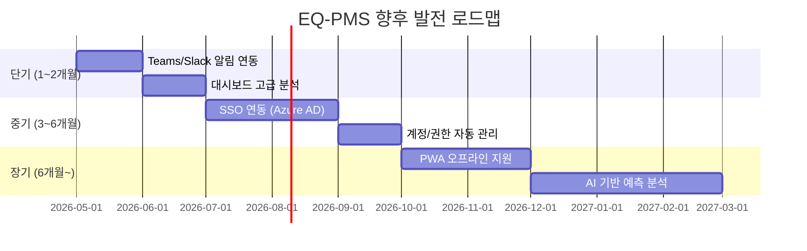

### 13-1. SSO 연동 (기업 표준 계정 체계)

**SSO (Single Sign-On)**: 회사 계정 하나로 여러 사내 시스템에 로그인하는 통합 인증 방식

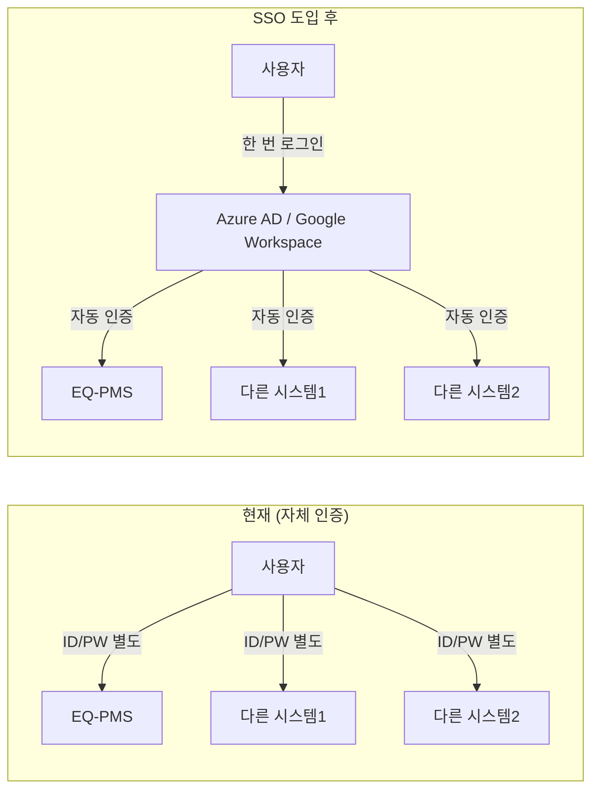

**도입 효과:**
| 항목 | 현재 | SSO 도입 후 |
|------|------|------------|
| 계정 관리 | EQ-PMS 자체 계정 (admin/pm/eng/client) | 회사 메일 계정과 통합 |
| 보안 | 고정 비밀번호 (1234) | 회사 정책 적용 (2FA 등) |
| 입/퇴사 처리 | 수동 계정 생성/삭제 | 자동 권한 부여/회수 |
| 부서/직급 | 수동 입력 | AD에서 자동 연동 |

---

### 13-2. 알림 채널 확대 (Teams / Slack 연동)

**현재**: 이슈 등록 시 이메일만 발송 → **실시간성 부족**

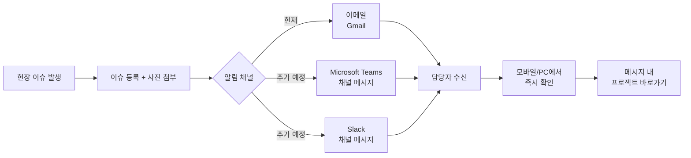

**추가 가능한 알림 시나리오:**
- High 등급 이슈 발생 시 담당 팀 채널 즉시 알림
- Buy-off 서명 완료 시 관련 팀 전체 공지
- 출입증 만료 임박 시 당사자 + 관리자 알림
- 일정 지연 경고 (계획 대비 실적 차이 큰 경우)

---

### 13-3. 대시보드 고급 분석 강화

**현재**: 기본 통계 + 심각도/상태 차트 + 평균 Lead Time/MTTR

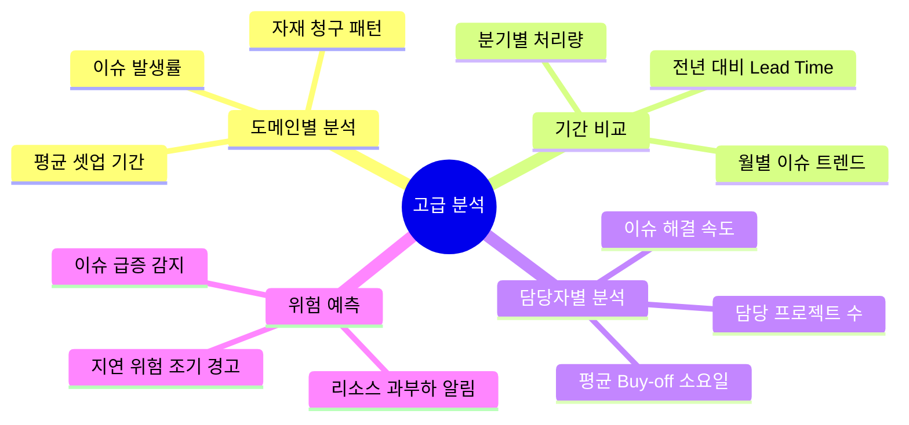

---

### 13-4. 모바일 PWA 지원 (오프라인 대응)

**PWA (Progressive Web App)**: 웹앱을 네이티브 앱처럼 설치 가능하게 만들고, 오프라인에서도 동작

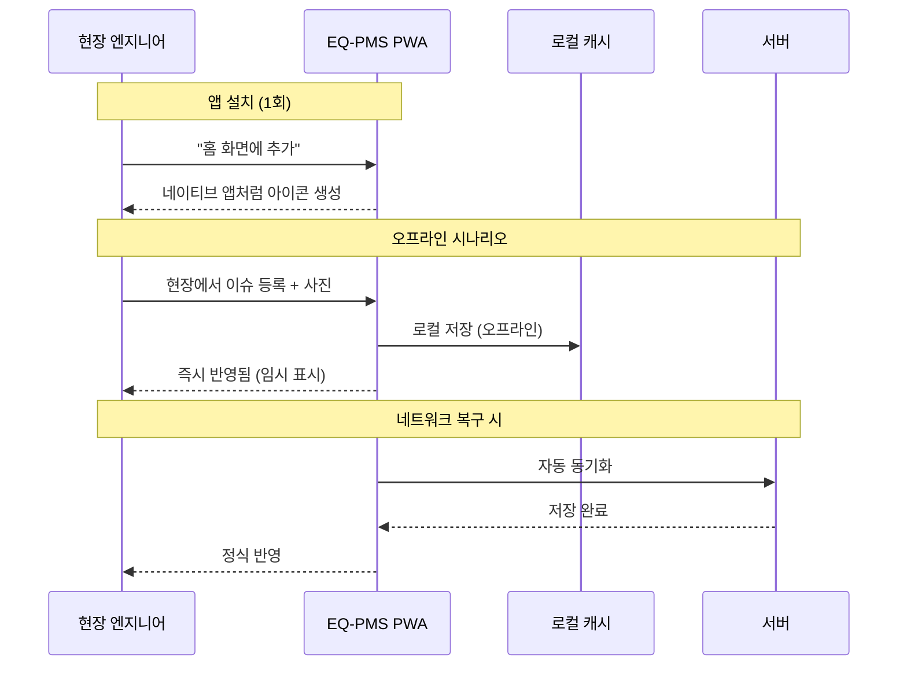

**현장 시나리오:**
- 반도체 Fab 청정실 → Wi-Fi 약함 → 오프라인으로 체크리스트 입력
- 해외 현장 → 데이터 로밍 부담 → 오프라인 작성 후 Wi-Fi 구역에서 일괄 업로드
- 장비실 지하 → 신호 없음 → 이슈 사진 촬영/작성 → 복귀 후 자동 전송

---

### 13-5. 우선순위 및 도입 효과 요약

| 단계 | 항목 | 구현 난이도 | 도입 효과 |
|------|------|------------|----------|
| **1순위** | Teams/Slack 알림 연동 | 낮 (GAS 설정만) | 실시간 대응력 향상 |
| **2순위** | 대시보드 고급 분석 | 중 (차트 추가 개발) | 경영진 보고/의사결정 지원 |
| **3순위** | SSO 연동 | 중 (IT팀 협조 필요) | 보안/계정관리 대폭 개선 |
| **4순위** | PWA 오프라인 지원 | 중 (manifest + Service Worker) | 현장 접근성 향상 |
| **5순위** | AI 기반 예측 분석 | 높 (데이터 축적 후 가능) | 위험 사전 감지 / 자동 분류 |

