# 자재/스페어파트 파이프라인 설계 명세서

> **버전:** v0.1 (초안)  
> **작성일:** 2026-05-14  
> **협의 대상:** 설계팀 · 구매팀 · 개발팀  
> **목적:** 자재 생애주기(설계→구매→QC→제조→고객납품) 추적 시스템 설계 확정

---

## 1. 배경 및 문제 정의

### 현재 문제점

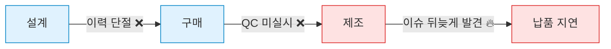

| 문제 | 영향 |
|------|------|
| 설계→구매 단계 이력 단절 | 누가 언제 무엇을 했는지 추적 불가 |
| QC 게이트 없음 | 불량이 제조 단계까지 넘어가서 발견 → 비용·일정 손실 |
| 수기 문서 작업 과다 | QC 성적서, 납품확인서 매번 직접 작성 |
| 현재 위치 불투명 | 자재가 어느 단계인지 실시간 파악 불가 |

---

## 2. 목표

- **QC 강제 게이트**: QC 미완료 시 제조 단계 진입 물리적 차단
- **완전한 이력 추적**: 모든 단계 전환에 담당자·시각 자동 기록
- **최소 입력**: QR 스캔 + 탭 몇 번으로 단계 처리 완료
- **자동 문서 생성**: QC 성적서·납품확인서 AI 자동 생성

---

## 3. 전체 파이프라인

### 3-1. 5단계 파이프라인 개요

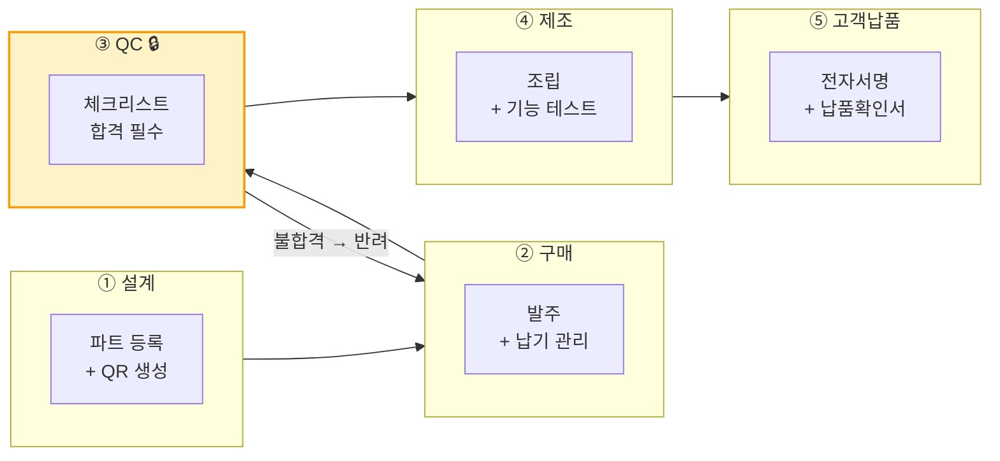

### 3-2. 자재 타입별 분기

이 시스템은 두 가지 자재 타입을 동일한 파이프라인으로 처리합니다.

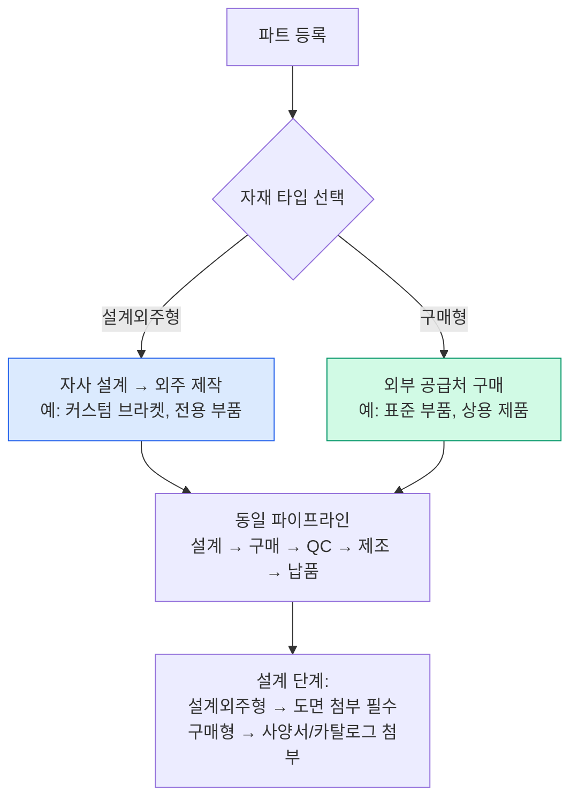

---

## 4. QR 기반 워크플로우

### 4-1. QR 생성 → 부착 → 스캔 흐름

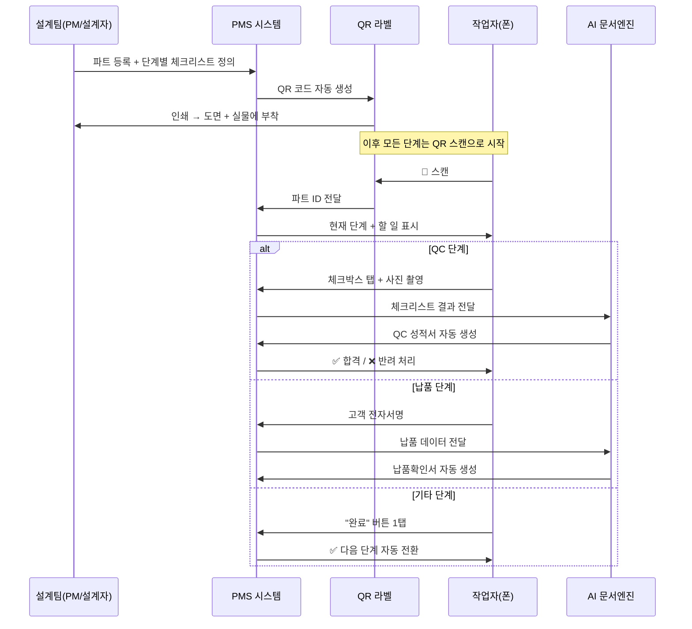

### 4-2. QR 라벨 구성

설계 단계에서 파트를 등록하면 아래 형태의 라벨이 자동 생성됩니다.

```
┌─────────────────────────────────────────┐
│  PRJ-2026-001        PART-2026-001      │
│  파트명: XXX 모터 브라켓                │
│  도면번호: DRW-MAK-0042                 │
│  수량: 5EA  |  긴급도: High             │
│  프로젝트: ○○○ 장비 셋업               │
│                                         │
│  [██████████]    QC 체크리스트 미리보기 │
│  [██ QR ████]    □ 치수 검사            │
│  [██████████]    □ 표면 처리 확인       │
│                  □ 재질 확인            │
└─────────────────────────────────────────┘
```

- 도면에 삽입: 설계 도면 우측 상단 또는 표제란에 QR 삽입
- 실물에 부착: 내구성 스티커 라벨 출력 → 자재/박스에 부착

---

## 5. 단계별 상세

### 5-1. ① 설계 (담당: 설계팀)

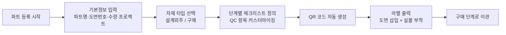

**설계팀 입력 항목:**

| 항목 | 필수 | 설명 |
|------|------|------|
| 파트명 | ✅ | 품명 |
| 도면번호 | ✅ | DRW- 형식 권장 |
| 수량 | ✅ | EA 단위 |
| 자재 타입 | ✅ | 설계외주 / 구매 |
| 프로젝트 연결 | ✅ | 관련 프로젝트 선택 |
| QC 체크리스트 | ✅ | 검사 항목 정의 (최소 1개) |
| 도면 파일 | 권장 | PDF/DWG 첨부 |
| 긴급도 | 선택 | High / Medium / Low |

---

### 5-2. ② 구매 (담당: 구매팀)

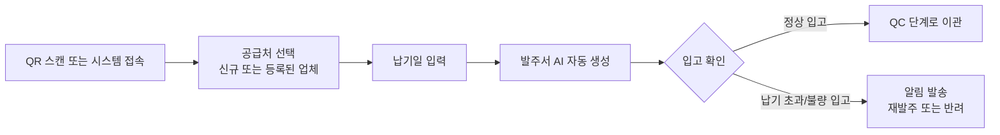

**구매팀 입력 항목:**

| 항목 | 필수 | 설명 |
|------|------|------|
| 공급처 | ✅ | 업체명 선택/입력 |
| 발주번호 | 자동 | 시스템 자동 채번 |
| 납기일 | ✅ | 목표 입고 날짜 |
| 단가/금액 | 선택 | 견적 금액 |
| 발주서 | 자동 | AI 자동 생성 |

---

### 5-3. ③ QC — 필수 게이트 🔒 (담당: 품질/구매팀)

> **이 단계를 완료하지 않으면 제조 단계로 진입할 수 없습니다.**

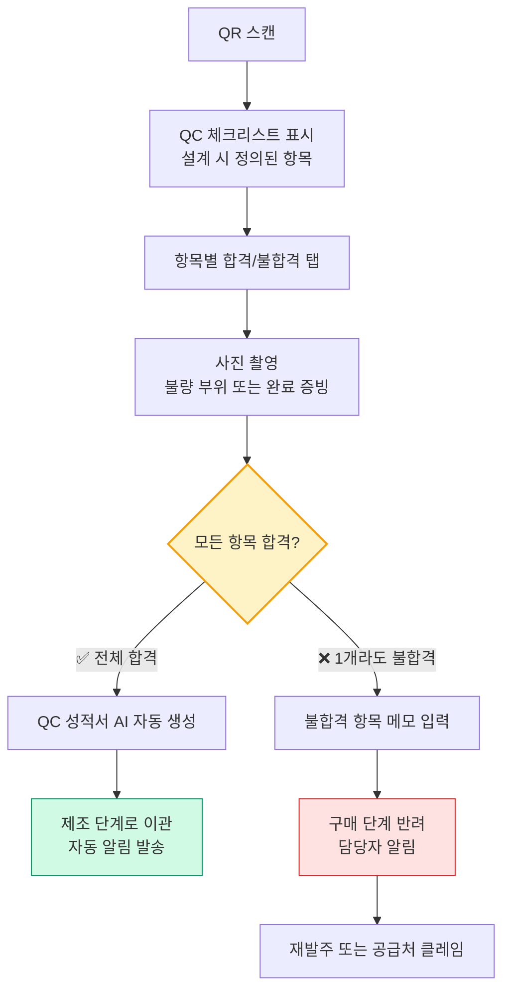

**QC 체크리스트 예시 (자재 타입별):**

| 설계외주형 예시 | 구매형 예시 |
|----------------|------------|
| □ 치수 검사 (도면 대비) | □ 외관 검사 |
| □ 표면 처리 확인 | □ 규격/사양 확인 |
| □ 재질 확인 | □ 수량 확인 |
| □ 가공 정밀도 | □ 포장 상태 |
| □ 도면 번호 일치 여부 | □ 납품서 확인 |

---

### 5-4. ④ 제조 (담당: 제조팀/엔지니어)


---

### 5-5. ⑤ 고객납품 (담당: 엔지니어/PM)

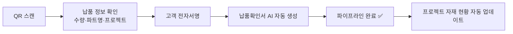

---

## 6. 데이터 구조

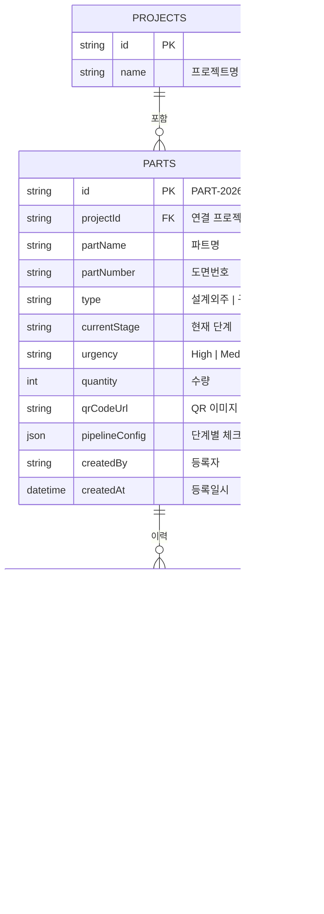

---

## 7. 역할별 권한 및 책임

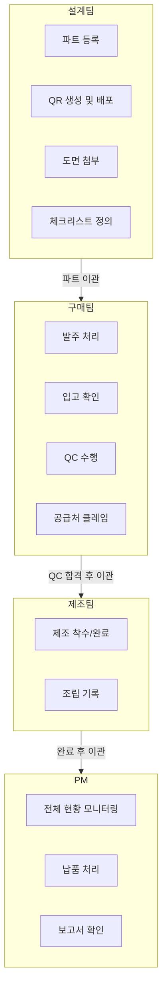

| 역할 | 가능한 작업 |
|------|------------|
| 설계팀 (PM/ENGINEER) | 파트 등록, QR 생성, 도면 첨부, 체크리스트 정의 |
| 구매팀 (PM) | 발주 처리, 입고 확인, QC 수행, 반려 처리 |
| 제조팀 (ENGINEER) | 제조 착수/완료 처리 |
| PM/ADMIN | 전체 현황 조회, 납품 처리, 문서 확인 |
| CUSTOMER | 납품 서명, 본인 프로젝트 현황 조회 |

---

## 8. 자동 생성 문서

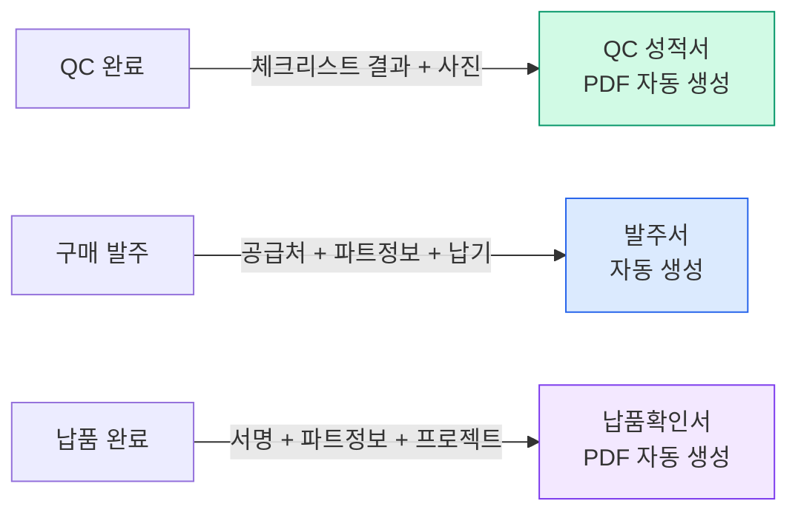

---

## 9. 기존 시스템과의 연계

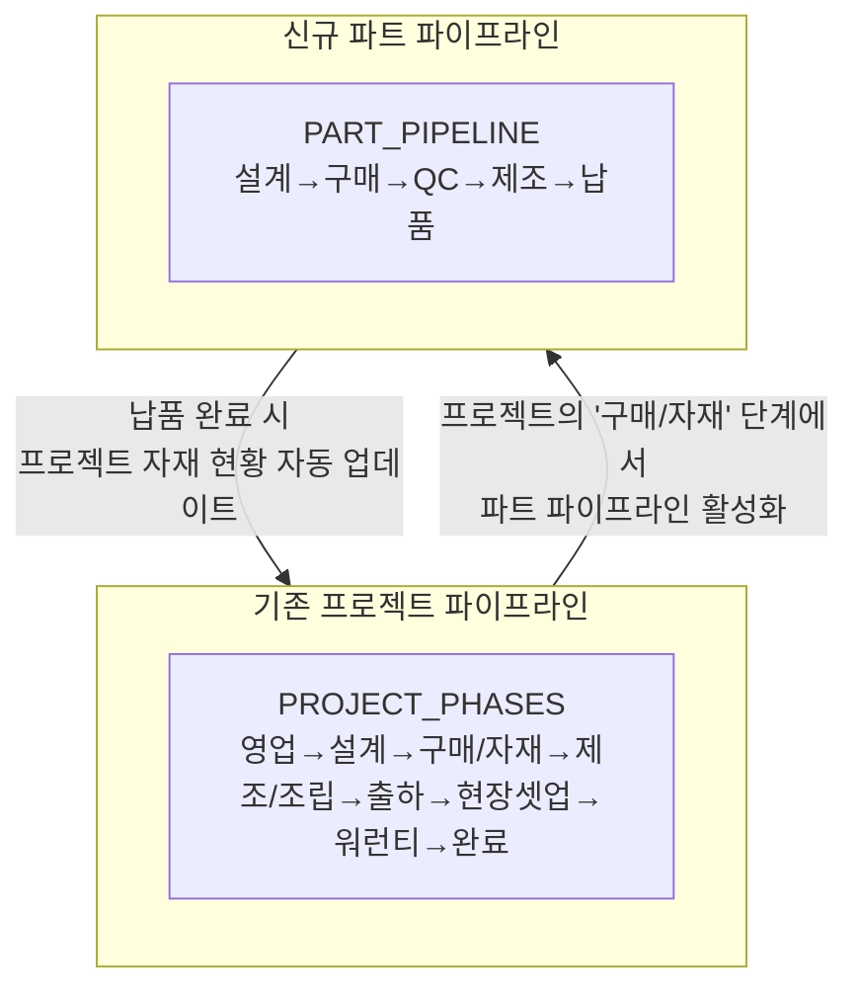

- 기존 `PART_PHASES: ['청구', '발주', '입고', '교체완료']` → 현장 스페어파트 교체용으로 유지
- 신규 파트 파이프라인 → 신규 제작/구매 자재의 생애주기 관리

---

## 10. 입력량 비교 (Before / After)

| 단계 | 기존 방식 | 신규 방식 |
|------|-----------|-----------|
| 파트 등록 | 폼 전체 수기 입력 | 기본정보 + 체크리스트 선택 |
| 구매 처리 | 별도 문서 작성 | QR 스캔 → 공급처 선택 → 탭 |
| QC | 성적서 수기 작성 (30~60분) | QR → 체크박스 탭 → 사진 → **AI 자동 생성** (3분) |
| 제조 완료 | 보고서 수기 작성 | QR → 버튼 1탭 |
| 납품 | 확인서 수기 작성 | QR → 고객 서명 → **AI 자동 생성** |

---

## 11. 오픈 이슈 (협의 필요)

- [ ] **QC 체크리스트 표준화**: 자재 타입별 기본 템플릿 설계팀과 사전 협의 필요
- [ ] **공급처 마스터 데이터**: 기존 등록된 업체 목록 구매팀 제공 필요
- [ ] **QR 라벨 규격**: 도면 삽입 위치·크기 설계팀 확인 필요
- [ ] **납기 알림 기준**: 납기 D-몇일 전에 알림 발송할지 구매팀 결정 필요
- [ ] **문서 보관 기간**: 성적서·납품확인서 보관 기간 및 보관 방식 협의 필요

---

*이 문서는 설계팀·구매팀과의 협의를 위한 초안입니다. 피드백을 반영하여 업데이트됩니다.*
